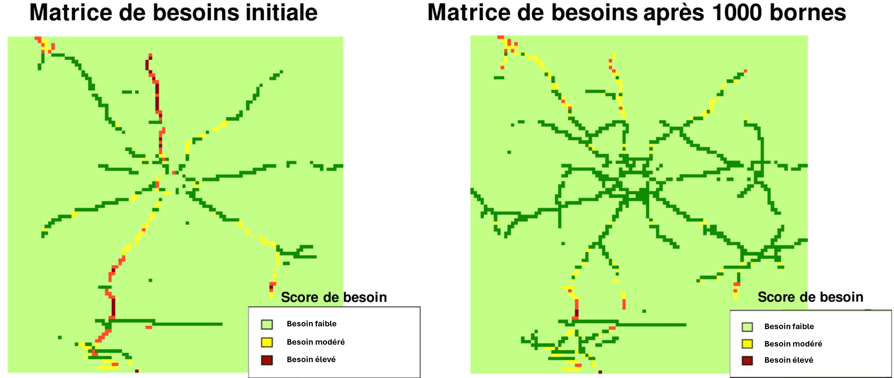

# Data Scientist
#### Technical Skills: Python, R, SQL, PowerBI, MongoDB, Neo4j

## Formation
Ingénieur agronome, spécialisé en sciences des données  
L'institut Agro Rennes-Angers (_Septembre 2023_)	

## Expérience
**Stagiaire data scientist @ INRAE & CIRAD Montpellier (_Février 2023 - Juillet 2023_)**
- 
Manipulation de données spectro (spectres NIRS) et d'images (drone) 
- 
Création et optimisation d'algorithmes de machine learning prédictifs
- 
Data visualisation poussée dans le but de répondre à des questions scientifiques

## Projets
**Prix du meilleur projet au data challenge Rennes 2023 organisé par Enedis, Groupama et l'université de Rennes 2**
Ce projet a été réalisé en un total de 26h (début 10h, fin 12h le lendemain) et consistait à placer de façon optimisée des bornes de recharge électriques en Ille-et-Vilaine, notre stratégie :
- 
Création d'une matrice de la carte d'Ille et Vilaine découpée en carrés de 1km²
- 
Développement d'un indice de besoin pondéré de borne de recharge électrique, appliqué à la matrice
- 
Placement optimisé et dans l'ordre de nécessité du placement des "n" nouvelles bornes souhaitées dans la matrice et obtention d'une nouvelle matrice

**3e place au Hackaton du PeREN "Segmente-moi si tu peux"**
- 
Ce projet a été réalisé en un total de 8h sur place et consistait à obtenir le meilleur score possible à cahque soumission (max : 1 million)
- 
Il fallait réaliser de la classification non supervisée d'algorithmes de facturation de livraisons de commandes type Delviroo, Uber eats, etc
- 
Score maximum personnel : 200 000 (maximum réalisé 400 000)
